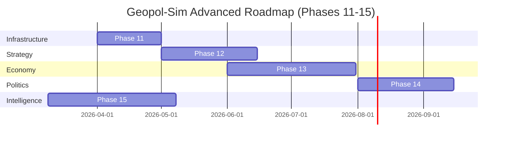

# Geopol-Sim Development Roadmap: Phases 11-15

This plan analyzes the current state of the `strategify` project after the completion of Phase 10 (3rd Party Work), identifies critical architectural gaps, and proposes a roadmap for the next development cycle.

## Project Analysis & Current Issues

The "3rd Party" implementation of Phases 6-10 has significantly expanded the simulation's scope. However, several critical issues remain:

### 1. Technical Debt: Mesa 3.0 Migration
- **[IMPORTANT] Mesa 2.3.4 Pinning**: The project remains pinned to an older version of Mesa. Mesa 3.0 offers significant performance improvements and a cleaner API, but the transition is non-trivial due to changes in `GeoSpace` and `Schedule`.

### 2. Performance Bottlenecks
- **Linear Agent Lookups**: Files like `conflict.py` and `non_state.py` perform $O(N)$ searches through the agent schedule to find specific regions or owners. With many agents and units, this will lead to a performance collapse.
- **Pairwise Combat**: The current combat engine is $O(U^2)$ where $U$ is the number of units. Spatial indexing (R-tree) should be leveraged more effectively.

### 3. Logical Gaps
- **Military-Decision Disconnect**: Agents decide to escalate or de-escalate without directly considering their current unit strength or readiness. The kinetic layer is "passive" relative to the Nash decision loop.
- **Hardcoded Terrain**: The `ConflictEngine` uses a hardcoded dictionary for terrain, which fails when moving to new geographic scenarios.

---

## Proposed Roadmap (Phases 11-15)

The next cycle focuses on **Optimization**, **Integration**, and **Global Systems**.

### Phase 11: Mesa 3.0 Migration & Architectural Optimization
**Goal**: Modernize the stack and remove $O(N)$ bottlenecks.
- **Mesa 3.0 Port**: Update `GeopolModel` and `GeoSpace` to use the latest Mesa API.
- **Spatial Lookups**: Implement a cached `region_id -> Agent` map and use `mesa-geo`'s spatial index for unit-to-region lookups.
- **Unified Step Order**: Refactor the model step to ensure determinism across `Military`, `Environment`, and `Economy` components.

### Phase 12: Integrated Command & Military AI
**Goal**: Link the kinetic engine to the decision-making brain.
- **Command Actions**: Add "Deploy," "Withdraw," and "Invade" actions to the game-theoretic action space.
- **Power Projection**: Incorporate `MilitaryComponent.get_total_power()` into the `InfluenceMap` calculations.
- **Unit Autonomy**: Give units basic "Mission" states (Patrol, Intercept, Occupy) so they don't require manual movement every step.

### Phase 13: Industrial Base & Production Chains
**Goal**: Move from "Spawning" units to "Building" them.
- **Infrastructure Agents**: Add static agents representing industrial nodes (Ports, Factories, Refineries).
- **Production Loop**: Agents must spend Resources (Phase 9) and GDP (Phase 2) at Industrial nodes to produce or repair Units (Phase 6).
- **Logistics Interdiction**: Allow units to target "Supply Hubs" to cripple an opponent's readiness recovery.

### Phase 14: Global Governance & International Law
**Goal**: Modeling the "Costs of Aggression" beyond simple tension.
- **Sovereignty System**: Formalize the concept of "Borders." Crossing into foreign territory without a "Declaratory War" state triggers global sanctions.
- **Summit Orchestrator**: Refactor `MultilateralSummit` to support 20+ members with voting weights and "Resolution" effects (e.g., mandatory trade freezes).

### Phase 15: MARL Policy Tournament (Full Scale)
**Goal**: Validate the complex model against sophisticated AI behaviors.
- **High-Dim RL**: Train policies that look at the full state: Units, Resources, Factions, and Diplomacy.
- **Scenario Stress Testing**: Use RL agents to find "Black Swan" events or model collapses in the Phase 11-14 systems.

---

## User Review Required

> [!IMPORTANT]
> - **Mesa 3.0**: Does the user have specific constraints (e.g., external dependencies) that prevent upgrading from Mesa 2.3.4?
> - **Industrial Base**: Should Phase 13 focus on "Detailed Supply Chains" (Water -> Food -> Pop) or "Abstract Production" (Resources -> Military Power)?

## Verification Plan

### Automated Tests
- `pytest tests/test_mesa3_migration.py` — Ensure no regressions in spatial logic.
- `pytest tests/test_spatial_performance.py` — Benchmark of lookup speeds with 1000+ units.
- `pytest tests/test_production_loop.py` — Verifying resource-to-unit conversion logic.

### Manual Verification
- Visual inspection of the "Industrial Nodes" on the dashboard.
- Simulation run of a "World War" scenario to verify global governance/summit triggers.
