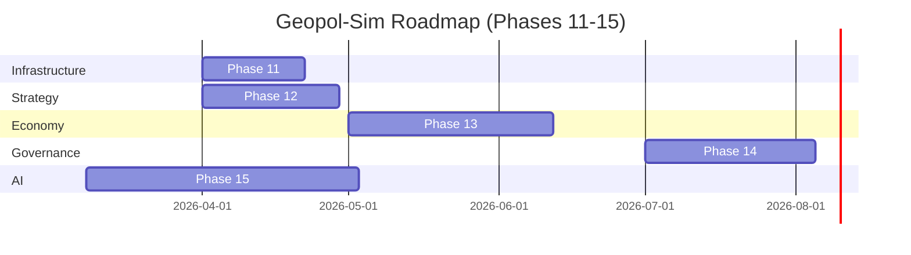

# Geopol-Sim: Project Audit & Phase 11-15 Roadmap

**Audit Date:** 2026-03-30 | **Auditor:** Antigravity  
**Python:** 3.14.2 | **Mesa:** 2.3.4 | **Test Suite:** 636 tests

---

## 1. Verification Results (Phases 6-10)

Phase 8 had a **critical defect in the verification script** (not the production code). The fix was a one-line correction — the test was never enabling the feature it was testing.

| Phase | Description | Status | Notes |
|---|---|---|---|
| **Phase 6** | Kinetic Logistics & Combat | ✅ PASS | Combat attrition verified |
| **Phase 7** | Internal Factions & Stability | ✅ PASS | Domestic reform triggers verified |
| **Phase 8** | Non-State Actors & Cyber | ✅ PASS (after fix) | `enable_non_state_actors=True` was missing from test calls |
| **Phase 9** | Climate & Resource Scarcity | ✅ PASS | Drought + pressure → stability confirmed |
| **Phase 10** | MARL RL Environment | ✅ PASS | 8-dim observation space verified |
| **Full pytest** | 636 unit + integration tests | ✅ **636 passed, 0 failed** | 84.48% coverage (threshold: 70%) |

### Phase 8 Bug Fixed

```diff
# verify_phase8.py (lines 17, 29, 48)
- model = GeopolModel(enable_economics=False, enable_escalation_ladder=True)
+ model = GeopolModel(enable_economics=False, enable_escalation_ladder=True, enable_non_state_actors=True)
```

> [!NOTE]
> This was a test-script authoring error. The production code in `model.py` correctly defaults `enable_non_state_actors` to `False` (opt-in design), and `_spawn_initial_non_state_actors()` works correctly when enabled.

---

## 2. Codebase Issues & Technical Debt

### 2.1 Critical: Mesa 2.3.4 Hard Pin

The `README.md` explicitly states: *"Mesa 2.3.4 (pinned — do not upgrade to Mesa 3)"*. This is a **deliberate architectural constraint**, not an oversight. The rationale is that `mesa-geo`'s `GeoSpace` API changed significantly in Mesa 3.x. While this ensures stability, it:
- Locks out Mesa 3.x scheduling performance improvements (parallel activation, `AgentSet`)
- Means all `RandomActivation` deprecation warnings will accumulate as Mesa 3.x becomes the ecosystem standard
- **1,258 warnings** during the test run — almost all are Mesa/libpysal deprecation warnings about legacy geometry APIs

### 2.2 Performance: $O(N)$ Agent Lookups

Three separate modules perform full schedule scans to find specific agents by `region_id`:

| File | Problem | Impact |
|---|---|---|
| `conflict.py:78` | `for agent in model.schedule.agents` inside `_execute_combat()` | Called every combat round, $O(A \cdot U^2)$ |
| `non_state.py:66-73` | `for a in model.schedule.agents` inside `_apply()` | Every non-state actor step |
| `state_actor.py:124-126` | `for a in model.schedule.agents` to find rival | Every agent, every step |

**Fix**: The model already builds a partial `agents_by_region` dict during init — this should be persisted as `self._agent_registry: dict[str, BaseActorAgent]` and updated on spawn/removal.

### 2.3 Logical Gap: Military-Decision Disconnect

The `decide()` method in `state_actor.py` computes Nash actions based on influence maps, OSINT, economics, and resource pressure — but **never reads `self.military.get_total_power()`**. Military power is invisible to diplomacy. An agent with zero units behaves identically to one with full armor divisions.

### 2.4 Hardcoded Terrain Data

`ConflictEngine.terrain_map` is a static Python dict hardcoded to 4 Eastern European regions. Any other scenario (Middle East, Pacific Rim) will silently fall through to `"Plain"` terrain, nullifying all terrain modifiers.

```python
# conflict.py:33-38 — fails silently for any non-hardcoded region
self.terrain_map = {
    "Ukraine": "Forest",
    "Russia": "Mountain",
    ...
}
```

### 2.5 Faction Power Doesn't Sum to 1.0

`get_default_factions()` returns factions with powers `[0.3, 0.3, 0.4]` = 1.0. But the "Domestic Reform" event in `_update_stability()` applies `random.uniform(-0.1, 0.1)` to each power without renormalizing, so total faction influence drifts between 0.7 and 1.3 over time. This isn't caught by any test.

### 2.6 Missing Phase 9: Migration Model

The `task.md` for Phase 9 marked the **Climate-driven MigrationModel** as incomplete (`[ ]`), but the `walkthrough_advanced.md` marks Phase 9 as done. The `EnvironmentalManager` has resource pressure and climate events but **no migration of agents between regions**. This is a feature gap, not a bug.

### 2.7 Stale Temp Files in Root

Files like `tmp_check_adj.py`, `tmp_check_dc.py`, `tmp_check_mesa_seed.py` and `tmp_check_repro.py` are legacy debugging artifacts at the project root. These should be cleaned up or moved to the `scripts/` directory.

---

## 3. Phase 11-15 Roadmap



---

### Phase 11: Optimization & Agent Registry (3 weeks)

**Goal**: Resolve performance bottlenecks and warning debt.

#### Key Changes

**`sim/model.py`** — Add a persistent agent registry:
```python
# In __init__, after agents are added to schedule:
self._agent_registry: dict[str, "BaseActorAgent"] = {
    getattr(a, "region_id", ""): a for a in self.schedule.agents
}

def get_agent_by_region(self, region_id: str):
    return self._agent_registry.get(region_id)
```

**`sim/conflict.py`** — Replace `O(N)` loop with registry call:
```python
# BEFORE (O(N) on every combat resolution):
for agent in self.model.schedule.agents:
    if isinstance(agent, StateActorAgent) and agent.geometry.contains(u1.location):
        ...

# AFTER (O(1)):
agent = self.model.get_agent_by_region(region_id)
```

**`agents/state_actor.py`** — Wire `military.get_total_power()` into `decide()`:
```python
# New signal in decide():
military_power = self.military.get_total_power()
military_bias = (military_power / 10.0) * 0.5  # Scale: 10 units = +0.5 bias
```

**`agents/factions.py`** — Normalize faction powers after reform:
```python
# In _update_stability, after random perturbation:
total = sum(f.power for f in self.factions) or 1.0
for f in self.factions: f.power /= total
```

**`sim/conflict.py`** — GeoJSON-driven terrain (read from region geometry properties):
```python
# Replace hardcoded dict with GeoDataFrame lookup:
def _get_terrain(self, region_id: str) -> str:
    row = self.model.region_gdf[self.model.region_gdf["region_id"] == region_id]
    if not row.empty and "terrain" in row.columns:
        return row.iloc[0]["terrain"]
    return "Plain"
```

---

### Phase 12: Military-Diplomacy Integration (4 weeks)

**Goal**: Make military realities influence diplomatic decisions.

- **New game actions**: `"Deploy"`, `"Invade"`, `"Withdraw"` added to `crisis_games.py`
- **Power Projection**: `MilitaryComponent.get_total_power()` → `InfluenceMap` (high-power agents project wider influence)
- **Unit Missions**: Add `mission: str` attribute to `Unit` (`"Patrol"` | `"Intercept"` | `"Occupy"`)
- **Occupation mechanic**: A unit in `"Occupy"` mode in a foreign region reduces that region's stability by a small amount each step

---

### Phase 13: Industrial Base & Production Chains (6 weeks)

**Goal**: Move from spawning units freely to earning them through production.

- **`agents/infrastructure.py`** — New `InfrastructureAgent` (Port, Factory, Refinery) with `production_capacity` and `health` attributes
- **Production loop**: Each step, `StateActorAgent` checks owned `InfrastructureAgent`s, spends `resource["Energy"]` + GDP share → produces/repairs 1 unit
- **Interdiction**: Units in `"Occupy"` mode at an enemy's infrastructure node set `infrastructure.health -= 0.1/step`
- **Logistics**: Extend `LogisticsManager` to route through factory nodes, not just geometric centroids

---

### Phase 14: Global Governance & International Law (5 weeks)

**Goal**: Formalise the cost of kinetic aggression.

- **Sovereignty violations**: If a unit crosses into foreign territory without a declared `"War"` state (new relation type in `DiplomacyGraph`), the model emits a `SovereigntyViolation` event — triggering auto-sanctions from all neutral states
- **Summit Orchestrator v2**: Refactor `MultilateralSummit` out of pairwise dispatch into a weighted-vote mechanism supporting 20+ members, with `"Resolution"` objects that have binding effects (trade freezes, arms embargoes)
- **Treaty system**: Persistent `Treaty` objects (Non-Aggression Pact, Alliance, Trade Agreement) with expiry and breach-detection logic

---

### Phase 15: MARL Full-Scale Tournament (8 weeks)

**Goal**: Use AI to stress-test the system and discover emergent strategies.

- **Expanded RL state**: Observe current unit counts, resource levels, faction stability, and active treaties (target: ~20-dim observation vector)
- **Training**: Integrate `stable-baselines3` or `ray[rllib]` for multi-agent policy training
- **Scenario stress-test**: Deploy trained policies against the Phase 11-14 systems to find collapse conditions ("Black Swan" discovery)
- **Policy comparison**: Nash-Baseline vs. RL-Trained — measure divergence to quantify gaps in traditional game-theory models

---

## 4. Verification Plan for Phase 11

### Automated Tests (to be written)
```bash
pytest tests/test_agent_registry.py        # O(1) lookup correctness
pytest tests/test_military_influence.py    # military power → influence map
pytest tests/test_faction_normalization.py # faction power sums to 1.0 post-reform
pytest tests/test_terrain_from_geojson.py  # terrain read from GeoJSON properties
```

### Performance Benchmarks
```bash
python scripts/benchmark_combat.py --n-agents 50 --n-units 500
# Expect: resolve_kinetic_combat() < 5ms per step
```

---

## 5. Cleanup Recommendations

These items can be resolved immediately with no risk:

| Item | Action |
|---|---|
| `tmp_check_*.py` in project root | Move to `scripts/` or delete |
| `=0.3`, `=2.0`, etc. files in root | **Artifact of failed `pip install` — delete immediately** |
| `nul`, `lib/` in root | Remove (Windows artifacts) |
| 1,258 pytest warnings | Suppress known-safe deprecations with `filterwarnings` in `pyproject.toml` |
